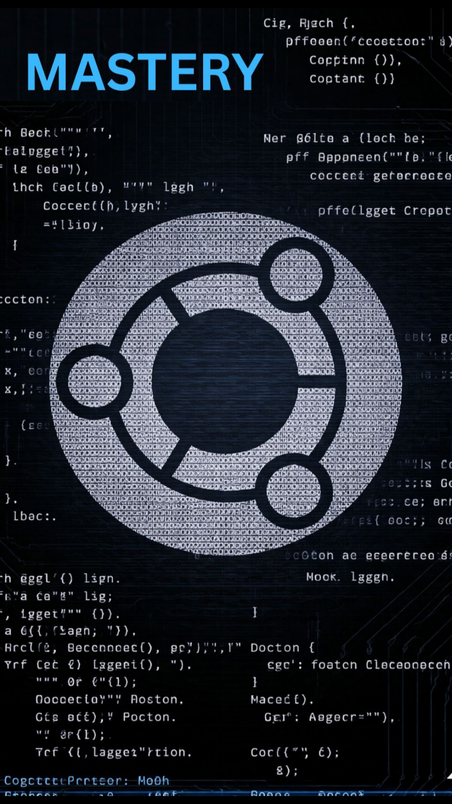

# Ubuntu-Linux-For-Termux
Ubuntu on Termux lets you run a full Ubuntu environment on Android without root. It provides access to Linux tools, apt packages, and development environments in a lightweight, portable setup—ideal for coding, learning, and experimentation on mobile.



## Install Termux

1. Go to F-Droid.org  
2. Download and install F-Droid  
3. Search for Termux  
4. Install Termux  
5. Open the Termux app  

---

## Commands

```
pkg update && pkg upgrade -y
```

## Install proot-distro

```
pkg install proot-distro
```

## Install Ubuntu

```
proot-distro install ubuntu
```

## Login to Ubuntu

```
proot-distro login ubuntu
```
